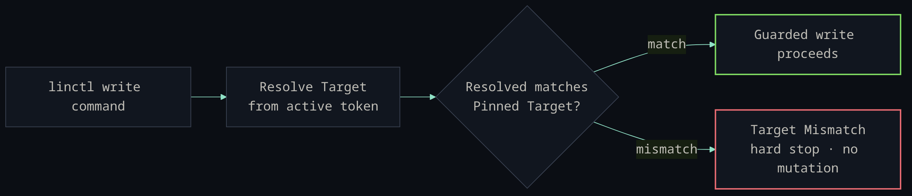
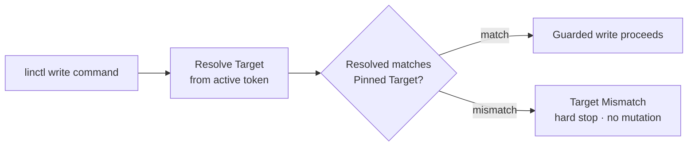

# linctl

[](https://github.com/KyaniteHQ/linctl/actions/workflows/ci.yml)
[](go.mod)
[](https://github.com/KyaniteHQ/linctl/releases/latest)
[](LICENSE)

> **Reads everywhere. Writes fail closed. No standing context cost.**

Your agent's Linear MCP server loads its tool definitions into every session before it does any
work, on the order of ~13k tokens (measured).[^mcp] `linctl` is one binary with no standing
context: only a command's output costs tokens, and reads need no pin. Every write re-resolves the
active token and **fails closed** when the resolved org/team doesn't match the target pinned for
the repo, so a stale or wrong token can't quietly land issues in the wrong team. There is no
bypass flag.


```bash
linctl issue list --mine --state started     # read anything
linctl issue create --title "Spike: exports" # write only inside the pinned target
```

## 🔒 How writes stay safe

linctl's vocabulary deliberately separates reads from writes:

- **Pinned Target** — the org/team/(optional project) a repo declares in `.linctl.toml`
  as the *only* allowed destination for writes.
- **Resolved Target** — the org/team/project proven from the active token at command time.
- **Target Mismatch** — when the two disagree. For a guarded write this is a **hard stop**,
  never a prompt or a warning.



The guard checks the **token**, not just the file. An agent that edits `.linctl.toml` to
point at another org still can't write there unless the token *it holds* also resolves to
that org. Team-scoped creates compare org + team (the entity does not exist yet);
resource-scoped updates and archives resolve the existing entity first, then compare the
pinned `project_id` when one is configured. There is **no bypass flag** — `--org`,
`--team`, and `--project` set the pinned target, they do not relax the guard. See
[`docs/adr/0001-target-pinned-linear-writes.md`](docs/adr/0001-target-pinned-linear-writes.md).

<details>
<summary>Mermaid source for the diagram above</summary>



</details>

## 🤖 Agent-first

linctl is built to be driven by an LLM agent from a Bash tool, with deterministic output
and no standing context cost:

- **No MCP tax.** The Linear MCP server loads ~13k tokens of tool definitions into every
  session before any work.[^mcp] linctl loads none — `linctl usage` returns a compact,
  on-demand reference (~400 tokens) and `linctl <group> --help` covers the rest.
- **Structured output.** `--json` / `--compact` / `--fields` / `--id-only` give stable,
  pipeable shapes; diagnostics go to stderr so stdout stays clean.
- **Drop-in skill.** [`skills/linctl/SKILL.md`](skills/linctl/SKILL.md) teaches an agent to
  drive linctl and ships an `AGENTS.md` snippet for consuming repos. Verify a checkout with
  no credentials via `bash skills/linctl/scripts/linctl-offline-smoke.sh`, or do a read-only
  token check via `bash skills/linctl/scripts/linctl-smoke.sh`.

## ⚡ Quickstart

### Install

```bash
# Homebrew cask (macOS)
brew install --cask KyaniteHQ/linctl/linctl

# Go toolchain (macOS / Linux / Windows)
go install github.com/KyaniteHQ/linctl/cmd/linctl@latest
```

```bash
linctl --version && linctl usage   # zero-config smoke check — no token required
```

Prebuilt binaries (darwin/linux/windows × amd64/arm64) and checksums are attached to
every [release](https://github.com/KyaniteHQ/linctl/releases/latest).

<details>
<summary>From source checkout</summary>

```bash
git clone https://github.com/KyaniteHQ/linctl.git && cd linctl
go install ./cmd/linctl
linctl --version
```

Use your platform or distro package manager to install Go first. If you install
Go manually from `go.dev/dl`, verify the published checksum and follow Go's
platform-specific instructions instead of replacing a managed `/usr/local/go`.

</details>

### Configure

Pin the target in `.linctl.toml` at the repo root, then supply a token by environment.

```bash
export LINCTL_TOKEN="lin_api_..."   # or LINEAR_API_KEY; never commit a token
```

<details>
<summary><code>.linctl.toml</code> example + credential precedence</summary>

```toml
[target]
org_id     = "linear-org-id"
team_key   = "LIT"
team_id    = "linear-team-id"
project_id = "optional-linear-project-id"   # omit for team-scoped writes
```

Credential precedence is `LINCTL_TOKEN` → `LINEAR_API_KEY` → a `token` in
`.linctl.toml` / `~/.config/linctl/config.toml`. A repo `.linctl.toml` overlays the
global config.

</details>

### First commands

```bash
linctl usage              # orientation — no token required
linctl target --json      # confirm the active token's org / team / project
linctl doctor             # config, token, and target health
linctl issue list --mine  # your issues in the pinned team
```

## 📖 Command reference

Across 60 top-level command groups, linctl maps the Linear schema. The most-used ones are below; the
exhaustive catalog with GraphQL backing lives in [`docs/domain-map.md`](docs/domain-map.md),
and `linctl <group> --help` lists every subcommand.

**Context & health**

```bash
linctl target --json          # resolved org/team/project for the active token
linctl doctor                 # config / token / target health report
linctl current                # the issue for the current git branch
linctl next --dry-run         # preview the top-ranked unblocked issue
```

**Issues** — reads, rich `list` filters, and guarded writes. Related: `issue-relation`, `comment`, `agent-session`.

```bash
linctl issue list --state started --mine --limit 20
linctl issue get LIT-123 --json
linctl issue deps LIT-123                       # parent / children / blocks / blocked-by
linctl issue search "flaky export test"
linctl issue create --title "Spike: exports" --assignee <user-id> --label <label-id> --estimate 3
linctl issue link https://example.com/spec LIT-123   # attach a URL (guarded)
```

<details>
<summary>More groups — projects, cycles, planning, teams, search, releases, customers, metadata</summary>

**Projects** — reads plus create/update/archive. Related: `project-update`, `project-status`, `project-label`, `project-relation`.

```bash
linctl project list --limit 20
linctl project get <project-id> --json
linctl project issues <project-id>
linctl project-milestone list <project-id>
```

**Cycles & sprints** — `cycle` writes the schema entity; `sprint` is a read-only report alias.

```bash
linctl cycle list
linctl sprint current                           # active cycle for the team
linctl sprint report <cycle-id>
```

**Planning** — Initiatives are the current strategic surface; `roadmap*` is legacy read-only.

```bash
linctl initiative list
linctl initiative projects <initiative-id>
linctl initiative-to-project list
```

**Teams, users & org**

```bash
linctl team list
linctl team members <team-id>
linctl user me
linctl organization teams
```

**Search**

```bash
linctl search issues "rate limit"
linctl semantic-search "exports are slow" --limit 20
```

**Releases** — `release`, `release-note`, `release-pipeline`, `release-stage`, `issue-to-release`, `external-link`.

```bash
linctl release list
linctl release-pipeline list
```

**Customers** — `customer`, `customer-need`, `customer-status`, `customer-tier`.

```bash
linctl customer list
linctl customer-need list
```

**Metadata & more** — most groups support `list`/`get` plus entity-specific reads:
`label`, `document`, `template`, `workflow-state`, `time-schedule`, `notification`,
`triage-responsibility`, `sla-configuration`, `rate-limit`, `application`, `audit-entry`,
`agent-activity`, `agent-session`, `agent-skill`, `external-user`, `custom-view`,
`favorite`, `emoji`, `attachment`. Run `linctl <group> --help` or see
[`docs/domain-map.md`](docs/domain-map.md).

</details>

## 🧰 Output & scripting

Output controls are global flags — combine them with any command.

| Flag | Effect |
| --- | --- |
| `--json` / `--compact` | JSON output; `--compact` makes it single-line |
| `--fields a,b.c` | project JSON to an allowlist of (dot-path) keys |
| `--id-only` | emit only the Linear id, for `$(...)` chaining |
| `--quiet` | suppress output on a successful write |
| `--fail-on-empty` | exit non-zero when a list result is empty (monitors) |
| `--sort FIELD --order asc\|desc` | deterministic list ordering |
| `--format minimal\|compact\|full` | human (non-JSON) output detail |
| `--profile` / `--org` / `--team` / `--project` | config profile and target overrides |
| `--timeout 30s` | per-request timeout |
| `--debug` | structured diagnostics to **stderr** (`LINCTL_DEBUG_JSON=1` for JSON) |

```bash
linctl issue list --json --compact --fields identifier,title,state
id=$(linctl --id-only issue create --title "task"); linctl issue start "$id"
linctl issue list --fail-on-empty --sort title --order asc
```

Stable JSON shapes for parsing are documented in
[`skills/linctl/references/json-output.md`](skills/linctl/references/json-output.md).

## ✍️ Guarded writes

Every mutation is checked against the pinned target before it runs. Coverage:

- **Issues** — `create` (with `--assignee`, `--label`, `--due-date`, `--estimate`,
  `--parent` for sub-issues, templates, and guarded `import`), `update` / `--append`,
  `start`, `comment`, `reply`, `close`, `done`, `next` start, and `link` (attach a URL).
- **Issue relations** — `relate`, `unrelate`.
- **Comments** — `update`, `delete`.
- **Projects** — `create`, `update`, `archive`. **Project updates** — `create`.
- **Documents** — `create`, `update`.
- **Cycles** — `create`, `update`, `archive`.
- **Project milestones** — `create`, `update`.

`--estimate` is validated against the team's estimation config; `--parent` confirms the
parent belongs to the pinned target. For test runs, create namespaced throwaway resources
(`linctl-it-<runid>`) and clean them up — close disposable issues, archive disposable
projects.

## 🔧 Development

```bash
go run github.com/go-task/task/v3/cmd/task@latest ci        # generate-check → vet → test → build → lint → actionlint → vuln
go run github.com/go-task/task/v3/cmd/task@latest coverage  # 100% hand-written statement coverage
```

`internal/client/generated.go` is generated by genqlient from
`internal/client/operations/*.graphql`; CI fails on drift, so run `go generate ./...` and
commit it after changing operations. Integration tests and the live smoke harness hit a
disposable Linear org and never run under plain `go test`:

```bash
LINCTL_TEST_TOKEN=<token> go test -count=1 -tags=integration ./internal/client
go run github.com/go-task/task/v3/cmd/task@latest live-smoke
```

Contributor workflow and the release process are in
[`CONTRIBUTING.md`](CONTRIBUTING.md); domain vocabulary is in [`CONTEXT.md`](CONTEXT.md);
command-to-GraphQL mapping and named test scenarios are under [`docs/`](docs/).

## 📄 License

[MIT](LICENSE) © 2026 KyaniteHQ

[^mcp]: Measured against the official Linear MCP server's tools/list: 38 tools, ~10.2k tokens compact and ~15.3k pretty-printed (tiktoken o200k_base), loaded before any work. The common ~13k is a midpoint; where you land depends on how your client serializes the schema and the Linear server version.
