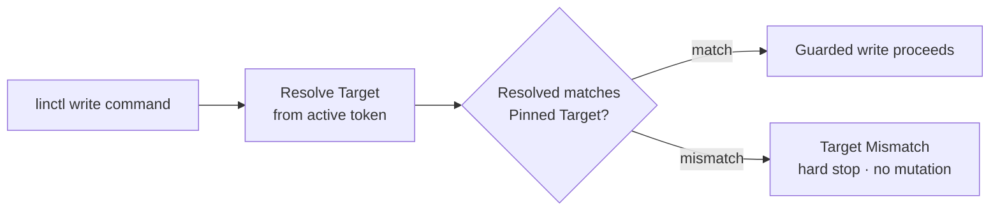

# linctl

[](https://github.com/KyaniteHQ/linctl/actions/workflows/ci.yml)
[](go.mod)
[](https://github.com/KyaniteHQ/linctl/releases/latest)
[](LICENSE)

> A **Linear control surface** for agent-safe coordination — free reads, target-pinned guarded writes.

`linctl` is a schema-aligned Go CLI for Linear. Reads are broad and cheap, so an agent
can inspect anything. Writes are different: every mutation re-resolves the active token
and **fails closed** unless the resolved org/team/project matches the target pinned for
the repo. One agent, scoped to exactly one place it is allowed to change.

```bash
linctl issue list --mine --state started     # read anything
linctl issue create --title "Spike: exports" # write only inside the pinned target
```

## ⚡ Quickstart

### Install

```bash
# Homebrew (macOS / Linux)
brew install --cask KyaniteHQ/linctl/linctl

# Go toolchain
go install github.com/KyaniteHQ/linctl/cmd/linctl@latest
```

Prebuilt binaries (darwin/linux/windows × amd64/arm64) and checksums are attached to
every [release](https://github.com/KyaniteHQ/linctl/releases/latest).

<details>
<summary>From source on a clean Linux machine</summary>

```bash
apt-get update
apt-get install -y build-essential ca-certificates curl git tar

curl -fsSL https://go.dev/dl/go1.26.4.linux-amd64.tar.gz -o /tmp/go.tar.gz
rm -rf /usr/local/go && tar -C /usr/local -xzf /tmp/go.tar.gz
export PATH="/usr/local/go/bin:$PATH"

git clone https://github.com/KyaniteHQ/linctl.git && cd linctl
go run ./cmd/linctl --version
```

</details>

### Configure

Pin the target in `.linctl.toml` at the repo root, then supply a token by environment.

```toml
[target]
org_id     = "linear-org-id"
team_key   = "LIT"
team_id    = "linear-team-id"
project_id = "optional-linear-project-id"   # omit for team-scoped writes
```

```bash
export LINCTL_TOKEN="lin_api_..."   # or LINEAR_API_KEY; never commit a token
```

Credential precedence is `LINCTL_TOKEN` → `LINEAR_API_KEY` → a `token` in
`.linctl.toml` / `~/.config/linctl/config.toml`. A repo `.linctl.toml` overlays the
global config.

### First commands

```bash
linctl usage              # orientation — no token required
linctl target --json      # confirm the active token's org / team / project
linctl doctor             # config, token, and target health
linctl issue list --mine  # your issues in the pinned team
```

## 🔒 How writes stay safe

linctl's vocabulary deliberately separates reads from writes:

- **Pinned Target** — the org/team/(optional project) a repo declares in `.linctl.toml`
  as the *only* allowed destination for writes.
- **Resolved Target** — the org/team/project proven from the active token at command time.
- **Target Mismatch** — when the two disagree. For a guarded write this is a **hard stop**,
  never a prompt or a warning.



Team-scoped creates compare org + team (the entity does not exist yet). Resource-scoped
updates and archives resolve the existing entity first, then compare the pinned
`project_id` when one is configured. There is **no bypass flag** — `--org`, `--team`, and
`--project` set the pinned target, they do not relax the guard. See
[`docs/adr/0001-target-pinned-linear-writes.md`](docs/adr/0001-target-pinned-linear-writes.md).

## 📖 Command reference

Across 58 top-level commands, linctl maps the Linear schema. The most-used ones are
below; the exhaustive catalog with GraphQL backing lives in
[`docs/domain-map.md`](docs/domain-map.md), and `linctl <group> --help` lists every
subcommand.

**Context & health**

```bash
linctl target --json          # resolved org/team/project for the active token
linctl doctor                 # config / token / target health report
linctl current                # the issue for the current git branch
linctl next --dry-run         # preview the top-ranked unblocked issue
```

**Issues** — reads, rich `list` filters, and guarded writes. Related: `issue-relation`, `comment`.

```bash
linctl issue list --state started --mine --limit 20
linctl issue list --has-blockers --created-after 2026-06-01
linctl issue get LIT-123 --json
linctl issue deps LIT-123                       # parent / children / blocks / blocked-by
linctl issue search "flaky export test"
linctl issue create --title "Spike: exports" --description-file ./spec.md
```

**Projects** — reads plus create/update/archive. Related: `project-update`, `project-status`, `project-label`, `project-relation`.

```bash
linctl project list --limit 20
linctl project get <project-id> --json
linctl project issues <project-id>
linctl project-milestone list <project-id>
```

**Cycles & sprints** — `cycle` writes the schema entity; `sprint` is a read-only report alias.

```bash
linctl cycle list
linctl cycle issues <cycle-id>
linctl sprint current                           # active cycle for the team
linctl sprint report <cycle-id>
```

**Planning** — Initiatives are the current strategic surface; `roadmap*` is legacy read-only.

```bash
linctl initiative list
linctl initiative projects <initiative-id>
linctl initiative-to-project list
linctl initiative-update list
```

**Teams, users & org**

```bash
linctl team list
linctl team members <team-id>
linctl user me
linctl user my-assigned-issues
linctl organization teams
```

**Search**

```bash
linctl search issues "rate limit"
linctl search projects "billing"
linctl semantic-search "exports are slow" --limit 20
```

**Releases** — `release`, `release-note`, `release-pipeline`, `release-stage`, `issue-to-release`, `external-link`.

```bash
linctl release list
linctl release-pipeline list
linctl release-stage list
```

**Customers** — `customer`, `customer-need`, `customer-status`, `customer-tier`.

```bash
linctl customer list
linctl customer-need list
```

**Metadata & more** — every group supports `list`/`get` plus entity-specific reads:
`label`, `document`, `template`, `workflow-state`, `time-schedule`, `notification`,
`triage-responsibility`, `sla-configuration`, `rate-limit`, `application`, `audit-entry`,
`agent-activity`, `agent-skill`, `external-user`, `custom-view`, `favorite`, `emoji`,
`attachment`. Run `linctl <group> --help` or see [`docs/domain-map.md`](docs/domain-map.md).

## 🧰 Output & scripting

Output controls are global flags — combine them with any command.

| Flag | Effect |
| --- | --- |
| `--json` / `--compact` | JSON output; `--compact` makes it single-line |
| `--fields a,b.c` | project JSON to an allowlist of (dot-path) keys |
| `--id-only` | emit only the Linear id, for `$(...)` chaining |
| `--quiet` | suppress output on a successful write |
| `--fail-on-empty` | exit non-zero when a list result is empty (monitors) |
| `--sort FIELD --order asc\|desc` | deterministic list ordering |
| `--format minimal\|compact\|full` | human (non-JSON) output detail |
| `--profile` / `--org` / `--team` / `--project` | config profile and target overrides |
| `--timeout 30s` | per-request timeout |
| `--debug` | structured diagnostics to **stderr** (`LINCTL_DEBUG_JSON=1` for JSON) |

```bash
linctl issue list --json --compact --fields identifier,title,state
id=$(linctl --id-only issue create --title "task"); linctl issue start "$id"
linctl issue list --fail-on-empty --sort title --order asc
```

Diagnostics go to stderr, so stdout stays clean for piping. Stable JSON shapes for
parsing are documented in
[`skills/linctl/references/json-output.md`](skills/linctl/references/json-output.md).

## ✍️ Guarded writes

Writes currently cover **issues** (`create`, `update`/`--append`, `start`, `comment`,
`reply`, `close`, and `done` for the branch issue), **projects** (`create`, `update`,
`archive`), **cycles** (`create`, `update`, `archive`), and **project milestones**
(`create`, `update`). Each is checked against the pinned target before it runs. For test
runs, create namespaced throwaway resources (`linctl-it-<runid>`) and clean them up —
close disposable issues, archive disposable projects.

## 🤖 For agents

linctl ships a skill that teaches an agent to drive it: see
[`skills/linctl/SKILL.md`](skills/linctl/SKILL.md). Verify a checkout with no
credentials via `bash skills/linctl/scripts/linctl-offline-smoke.sh`, or do a read-only
check with a token via `bash skills/linctl/scripts/linctl-smoke.sh`. The skill includes a
drop-in `AGENTS.md` snippet for consuming repos.

## 🔧 Development

```bash
go run github.com/go-task/task/v3/cmd/task@latest ci        # generate-check → vet → test → build → lint → vuln
go run github.com/go-task/task/v3/cmd/task@latest coverage  # 100% hand-written statement coverage
```

`internal/client/generated.go` is generated by genqlient from
`internal/client/operations/*.graphql`; CI fails on drift, so run `go generate ./...` and
commit it after changing operations. Integration tests and the live smoke harness hit a
disposable Linear org and never run under plain `go test`:

```bash
LINCTL_TEST_TOKEN=<token> go test -count=1 -tags=integration ./internal/client
go run github.com/go-task/task/v3/cmd/task@latest live-smoke
```

Contributor workflow and the release process are in
[`CONTRIBUTING.md`](CONTRIBUTING.md); domain vocabulary is in [`CONTEXT.md`](CONTEXT.md);
command-to-GraphQL mapping and named test scenarios are under [`docs/`](docs/).

## 📄 License

[MIT](LICENSE) © 2026 KyaniteHQ
