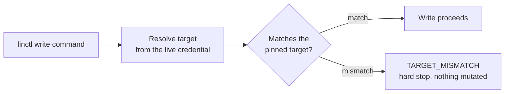

# linctl

[](https://github.com/KyaniteHQ/linctl/actions/workflows/ci.yml)
[](go.mod)
[](https://github.com/KyaniteHQ/linctl/releases/latest)
[](LICENSE)

**A Linear CLI you can hand to an AI agent.**

Your agent reads Linear as widely as its credential allows. It writes only to the one team you
named in the repo.

```bash
linctl issue list --mine                      # reads work anywhere
linctl issue create --title "Spike: exports"  # writes land only in the pinned team
```


<sub>Also available as a [4K master](docs/assets/explainer-4k60.mp4). Source:
[`demo/readme-hero/`](demo/readme-hero/).</sub>

---

## The problem

You give an agent write access to Linear. Then one of these happens:

- Its token is stale, or it is the wrong token.
- It is running in a checkout you forgot you had.
- It read the wrong config and picked another team.

It writes anyway. Issues land in the wrong team and you find out later.

An OAuth token is usually far broader than the job in front of it. linctl narrows it. You name
one team in the repo, and every write has to prove, against the live credential, that it is
going there.

## How the guard works

Before any write, linctl checks two things against the **live** OAuth credential, not against a
cached value and not just against the file on disk:

| | |
|---|---|
| **The organization** | The credential's own organization must be the one pinned in `.linctl.toml`. A token from a different organization fails here. |
| **The team** | The pinned team must be a team that credential can actually reach. A stale token that has lost access fails here. |

If both hold, the write runs. If either fails, linctl stops, exits non-zero, and prints
`{"error_code":"TARGET_MISMATCH"}`. It is not a prompt. It is not a warning. **There is no
bypass flag**, and adding one was [explicitly rejected](docs/adr/0001-linctl-architecture-baseline.md).


<details>
<summary>Diagram source (mermaid)</summary>


```mermaid
flowchart LR
    A[linctl write command] --> B[Resolve target<br/>from the live credential]
    B --> C{Matches the<br/>pinned target?}
    C -->|match| D[Write proceeds]
    C -->|mismatch| E[TARGET_MISMATCH<br/>hard stop, nothing mutated]
```

</details>

### Watch it refuse

The same `issue create`, run twice. Once into the pinned team, where it lands. Once at a team the
credential cannot reach, where nothing happens at all.


Real command output, real exit codes. The organization and issue ids are invented, so you can
re-record this yourself with [`demo/render-fixture.sh`](demo/render-fixture.sh) and no Linear
account at all.

### What the guard does not do

Read this part. A safety claim you have to walk back later is worse than one you scoped
honestly up front.

- **It stops a confused agent, not a hostile one.** A stale token, a wrong token, a drifted
  checkout, a misread config: caught. An agent that deliberately edits `.linctl.toml` to name
  a *sibling team its own token already reaches*: **not caught**. The guard narrows a
  credential; it cannot be stronger than that credential. Scope the token too.
- **It is a team boundary, not a correctness check.** If your agent updates the wrong issue
  *inside* the correctly pinned team, the guard has no opinion. It never claimed to.
- **It does not touch reads.** By design. `linctl issue list --all-teams` reads everything the
  token can see.
- **Label retire and restore can be organization-wide.** Those entities have no team, so
  `--org-wide` compares the organization only. It is an explicit flag that makes the blast
  radius visible, and a mismatch is still a hard stop, but it is not a team-level check.
- **The check and the write are separate API calls.** If something moves between them, the
  guard saw the old state. This is a narrow race, not a defense against a determined actor.

The value is not that the guard is unbreakable. It is that the boring, common, expensive
failure (an agent with the wrong auth writing somewhere real) becomes an exit code instead of
an incident.

## Why not the Linear MCP server?

The honest answer is that MCP is a fine way to give a hosted assistant access to Linear, and
if that is what you want, use it. linctl exists for a different setup: an agent with a shell,
in a repo, that you want to keep cheap and keep fenced.

Two differences matter.

**1. Standing context cost.** Most agent clients today fetch an MCP server's whole tool list up
front and put it in the model's context, before the agent does any work. Measured against the
official Linear MCP server on 2026-07-13: **47 tools, 13.6k tokens compact and 20.3k
pretty-printed.** Your client decides which end of that you pay, and you pay it every session,
whether or not the agent touches Linear.

linctl is a binary behind a Bash tool, so there is no tool schema to load. You pay for the
output of commands the agent actually ran. When it needs orientation it asks: `linctl usage`
prints ~400 tokens on demand, and `linctl <group> --help` covers the rest.


Do not take the number on faith, and do not assume it is still current. It moves fast: the same
server was 38 tools and 10.2k compact tokens in late June, so the standing cost grew about a
third in two weeks. Re-measure in a minute with
[`scripts/mcp-token-measure.sh`](scripts/mcp-token-measure.sh).

**2. The guard.** This is not something MCP *cannot* do; nothing in the protocol forbids it. It
is something the official Linear MCP server does not do. It hands an agent the full reach of
its token. linctl hands it that token narrowed to a target pinned in the repo, under your
version control rather than the agent's improvisation. That is the whole product.

Full comparison, including what MCP does better: [`docs/why-not-mcp.md`](docs/why-not-mcp.md).

---

## Install

```bash
# Homebrew cask (macOS)
brew install --cask KyaniteHQ/linctl/linctl

# Go toolchain (macOS / Linux / Windows)
go install github.com/KyaniteHQ/linctl/cmd/linctl@latest
```

```bash
linctl --version && linctl usage   # works with no auth and no config
```

Prebuilt binaries (darwin / linux / windows, amd64 and arm64) with checksums and signatures
are on every [release](https://github.com/KyaniteHQ/linctl/releases/latest).

**Next:** [`docs/quickstart.md`](docs/quickstart.md) takes you from a fresh install to a write
that lands, in about five minutes.

## Commands

62 command groups covering the Linear schema. The ones you will actually use:

```bash
linctl target --json          # what the live credential resolves to
linctl doctor                 # config, auth, and target health in one report
linctl current                # the issue for the current git branch
linctl next --dry-run         # preview the top-ranked unblocked issue

linctl issue list --state started --mine --limit 20
linctl issue get LIT-123 --json
linctl issue deps LIT-123     # parent, children, blocks, blocked-by
linctl issue search "flaky export test"
linctl issue create --title "Spike: exports" --assignee <user-id> --estimate 3
```

<details>
<summary>Everything else: projects, cycles, planning, teams, search, releases, customers</summary>

```bash
# Projects and milestones
linctl project list --limit 20
linctl project issues <project-id>
linctl project-milestone list <project-id>

# Cycles. `cycle` is the real entity and owns the writes; `sprint` is a read-only report alias.
linctl cycle list
linctl sprint current
linctl sprint report <cycle-id>

# Planning. Initiatives are current; roadmap commands are legacy reads only.
linctl initiative list
linctl initiative projects <initiative-id>

# Teams, users, org
linctl team list
linctl team members <team-id>
linctl user me

# Search
linctl search issues "rate limit"
linctl semantic-search "exports are slow" --limit 20

# Releases
linctl release list
linctl release-pipeline list

# Customers
linctl customer list
linctl customer-need list
```

Most other groups follow the same `list` / `get` shape: `label`, `document`, `template`,
`workflow-state`, `notification`, `attachment`, `custom-view`, `favorite`, `audit-entry`,
`agent-session`, and more. Run `linctl <group> --help`, or read the
[command-to-GraphQL map](docs/internal/domain-map.md).

</details>

## Output and scripting

These are global flags. Combine them with any command.

| Flag | Effect |
| --- | --- |
| `--json` / `--compact` | JSON output; `--compact` puts it on one line |
| `--fields a,b.c` | keep only these (dot-path) keys |
| `--id-only` | print just the Linear id, for `$(...)` chaining |
| `--quiet` | print nothing when a write succeeds |
| `--fail-on-empty` | exit non-zero when a list comes back empty, for monitors |
| `--sort FIELD --order asc\|desc` | deterministic ordering |
| `--format minimal\|compact\|full` | detail level for human output |
| `--profile` / `--org` / `--team` / `--team-id` / `--project` | pick a config profile, or set the pinned target |
| `--timeout 30s` | one deadline for the whole command, retries included |
| `--debug` | diagnostics to **stderr** (`LINCTL_DEBUG_JSON=1` for JSON) |

```bash
linctl issue list --json --compact --fields identifier,title,state
id=$(linctl --id-only issue create --title "task"); linctl issue start "$id"
linctl issue list --fail-on-empty --sort title --order asc
```

Diagnostics go to stderr, so stdout stays clean enough to pipe. JSON shapes are stable and
documented in [`skills/linctl/references/json-output.md`](skills/linctl/references/json-output.md).

`--org`, `--team`, `--team-id`, and `--project` **set** the pinned target. They do not relax
the guard. Everything still gets compared against the live credential.

## Every guarded write

If a command changes Linear, it goes through the guard. The complete list:

| Group | Guarded writes |
| --- | --- |
| `issue` | `create`, `import`, `update`, `start`, `close`, `comment`, `reply`, `link`, `add-label`, `remove-label` |
| `issue-relation` | `relate`, `unrelate` |
| `comment` | `update`, `delete`, `resolve`, `unresolve` |
| `project` | `create`, `update`, `archive`, `add-label`, `remove-label` |
| `project-update` | `create` |
| `project-milestone` | `create`, `update`, **`delete`** |
| `project-label` | `create`, `update`, `retire`, `restore` |
| `label` | `create`, `update`, `retire`, `restore` |
| `cycle` | `create`, `update`, `archive` |
| `document` | `create`, `update` |
| `files` | `upload` |
| `next` / `done` | reuse `issue start` and `issue close` |

Two of these are irreversible: **`project-milestone delete`** and **`comment delete`**. Nothing
in linctl brings them back. Everything else that removes something archives or retires it, so
it can be restored.

`--estimate` is validated against the team's estimation config. `--parent` confirms the parent
issue belongs to the pinned target. When you test against a real organization, create
throwaway resources named `linctl-it-<runid>` and clean them up after.

## For agents

linctl is meant to be driven by an LLM from a Bash tool.

Point your agent at [`skills/linctl/SKILL.md`](skills/linctl/SKILL.md). It teaches the command
surface, the output contracts, and the guard, and it ships an `AGENTS.md` snippet you can paste
into any repo that uses linctl.

Verify a checkout with no credentials at all:

```bash
bash skills/linctl/scripts/linctl-offline-smoke.sh   # no auth needed
bash skills/linctl/scripts/linctl-smoke.sh           # read-only auth check
```

## Development

```bash
go tool task ci                 # the full local gate; run before every PR
go tool task coverage           # 100% statement coverage on hand-written code
go tool task release-preflight  # pre-tag check; publishes nothing
```

`internal/client/generated.go` is generated by genqlient from
`internal/client/operations/*.graphql`. CI fails on drift, so run `go generate ./...` and commit
the result whenever you change an operation.

Contributor workflow and releases: [`CONTRIBUTING.md`](CONTRIBUTING.md).
Domain vocabulary: [`CONTEXT.md`](CONTEXT.md).
All documentation: [`docs/`](docs/README.md).
Reporting a vulnerability: [`SECURITY.md`](SECURITY.md).
Community expectations: [`CODE_OF_CONDUCT.md`](CODE_OF_CONDUCT.md).

## License

[MIT](LICENSE) © 2026 KyaniteHQ
