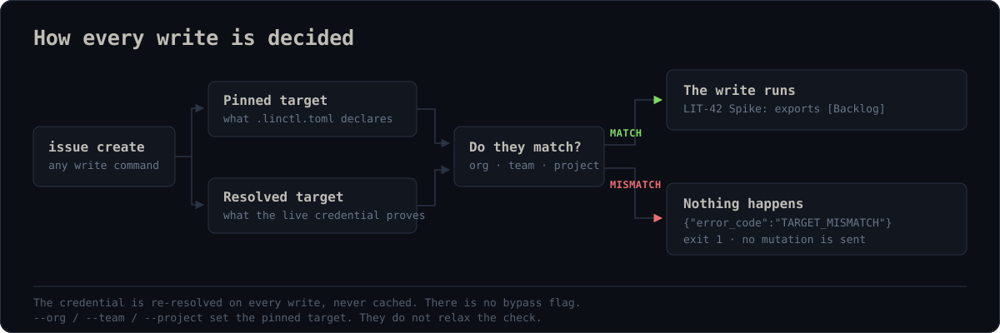
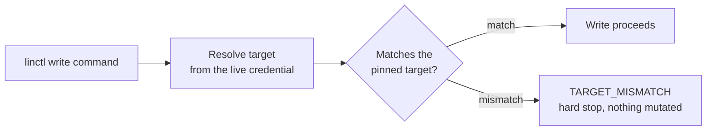
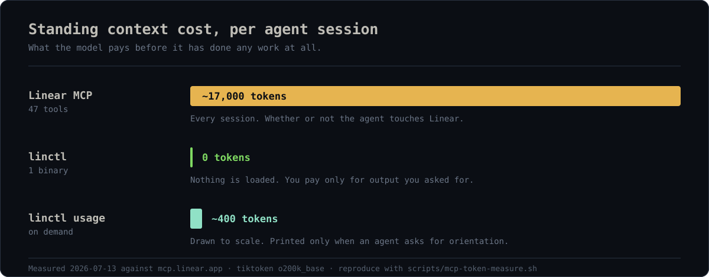

# linctl

[](https://github.com/KyaniteHQ/linctl/actions/workflows/ci.yml)
[](go.mod)
[](https://github.com/KyaniteHQ/linctl/releases/latest)
[](LICENSE)

**A Linear CLI that you can give to an AI agent.**

Your agent reads Linear as widely as its credential permits. Your agent writes only to the one
team that you name in the repo.

```bash
linctl issue list --mine                      # a read works anywhere
linctl issue create --title "Spike: exports"  # a write lands only in the pinned team
```


<sub>A [4K master](docs/assets/explainer-4k60.mp4) is also available. Source:
[`demo/readme-hero/`](demo/readme-hero/).</sub>

---

## The problem

You give an agent write access to Linear. Then one of these events occurs.

- The token is old, or it is the wrong token.
- The agent runs in a checkout that you forgot.
- The agent reads the wrong config and selects another team.

The agent writes anyway. The issues land in the wrong team, and you find the mistake later.

An OAuth token is usually much wider than the task in front of it. linctl makes the token
narrow. You name one team in the repo. Each write must then prove against the live credential
that it goes to that team.

## How the guard works

Before each write, linctl checks two facts against the **live** OAuth credential. linctl does
not use a cached value, and linctl does not trust the file on disk alone.

| | |
|---|---|
| **The organization** | The organization of the credential must be the organization pinned in `.linctl.toml`. A token from another organization fails here. |
| **The team** | The credential must reach the pinned team. An old token that lost its access fails here. |

If both facts hold, the write runs. If one fact fails, linctl stops, exits non-zero, and prints
`{"error_code":"TARGET_MISMATCH"}`. This is not a prompt. This is not a warning. **linctl has no
bypass flag.** [ADR 0001](docs/adr/0001-linctl-architecture-baseline.md) rejects a bypass flag.



<details>
<summary>Diagram source (mermaid)</summary>


```mermaid
flowchart LR
    A[linctl write command] --> B[Resolve target<br/>from the live credential]
    B --> C{Matches the<br/>pinned target?}
    C -->|match| D[Write proceeds]
    C -->|mismatch| E[TARGET_MISMATCH<br/>hard stop, nothing mutated]
```

</details>

### See linctl refuse a write

The recording runs the same `issue create` two times. The first run goes to the pinned team, and
the issue lands. The second run goes to a team that the credential cannot reach, and linctl
changes nothing.


The output and the exit codes are real. The organization id and the issue ids are invented, so
you can record the same demo with [`demo/render-fixture.sh`](demo/render-fixture.sh) and no
Linear account.

### What the guard does not do

Read this part. An honest limit is better than a safety claim that you must correct later.

- **The guard stops a confused agent. The guard does not stop a hostile agent.** linctl catches
  an old token, a wrong token, a stale checkout, and a config that the agent misread. linctl
  does not catch an agent that edits `.linctl.toml` to name a *sibling team that its own token
  already reaches*. The guard makes a credential narrow. The guard cannot be stronger than that
  credential. Make the token scope small as well.
- **The guard is a team boundary. The guard is not a correctness check.** If your agent updates
  the wrong issue *inside* the correct pinned team, the guard permits the write. The guard never
  claimed more.
- **The guard does not touch a read.** This is deliberate. `linctl issue list --all-teams` reads
  everything that the token can see.
- **Some label and team commands are organization-wide.** A label, a project label, and an
  initiative label have no team, so `--org-wide` compares the organization only. `team create`
  needs the same flag, because a new team is always outside the pinned team. The flag makes the
  blast radius visible, and a mismatch is still a hard stop, but the check is not a team check.
  The [generated guarded-write list](skills/linctl/references/guarded-writes.md) marks every
  command that takes the flag.
- **The check and the write are two API calls.** If the state changes between the two calls, the
  guard acted on the older state. This window is small. It is not a defense against a determined
  actor.

The value is not an unbreakable guard. One failure is common and expensive: an agent with the
wrong auth writes into a real team. The guard turns that failure into an exit code.

## linctl compared to the Linear MCP server

MCP is a good way to give a hosted assistant access to Linear. If you want that, use it. linctl
exists for a different setup: an agent with a shell, in a repo, that must stay cheap and stay
fenced.

Two differences are important.

**1. The standing context cost.** Most agent clients today read the whole tool list of an MCP
server. They put that list in the context of the model, before the agent does any work. The
measurement against the official Linear MCP server on 2026-07-13 gives **47 tools and about
17,000 tokens**: 13,620 tokens compact, and 20,256 tokens pretty-printed. Your client decides
which end of that range you pay. You pay it in each session, even when the agent does not touch
Linear.

linctl is a binary behind a Bash tool, so there is no tool schema to load. You pay only for the
output of the commands that the agent runs. When the agent needs orientation, it asks:
`linctl usage` prints about 400 tokens on demand, and `linctl <group> --help` covers the rest.



Do not trust that number, and do not assume that it is still correct. It moves quickly: the same
server had 38 tools and 10,200 compact tokens in late June 2026, so the standing cost grew about
one third in two weeks. Measure it again in about one minute with
[`scripts/mcp-token-measure.sh`](scripts/mcp-token-measure.sh).

**2. The guard.** MCP *can* do this; the protocol does not forbid it. The official Linear MCP
server does not do it. That server gives an agent the full reach of its token. linctl gives the
agent the same token, made narrow by a target pinned in the repo. That pin is under your version
control, not under the improvisation of the agent. That is the whole product.

The full comparison, and what MCP does better, is in
[`docs/why-not-mcp.md`](docs/why-not-mcp.md).

---

## Install

```bash
# Homebrew cask (macOS)
brew install --cask KyaniteHQ/linctl/linctl

# Go toolchain (macOS, Linux, Windows)
go install github.com/KyaniteHQ/linctl/cmd/linctl@latest
```

```bash
linctl --version && linctl usage   # this works with no auth and no config
```

Each [release](https://github.com/KyaniteHQ/linctl/releases/latest) also has prebuilt binaries
for darwin, linux, and windows, on amd64 and arm64, with checksums and signatures.

**Next:** [`docs/quickstart.md`](docs/quickstart.md) takes you from a new install to a write that
lands, in about five minutes.

## Commands

linctl covers the Linear schema with more than 60 top-level commands. These are the commands
that you use most.

```bash
linctl target --json          # what the live credential resolves to
linctl doctor                 # the health of the config, the auth, and the target
linctl current                # the issue of the current git branch
linctl next --dry-run         # the top-ranked unblocked issue, without a write

linctl issue list --state started --mine --limit 20
linctl issue get LIT-123 --json
linctl issue deps LIT-123     # the parent, the children, the blocks, and the blocked-by
linctl issue search "flaky export test"
linctl issue create --title "Spike: exports" --assignee <user-id> --estimate 3
```

<details>
<summary>Everything else: projects, cycles, planning, teams, search, releases, customers</summary>

```bash
# Projects and ProjectMilestones
linctl project list --limit 20
linctl project issues <project-id>
linctl project-milestone list <project-id>

# Cycles. `cycle` is the real entity and owns the writes. `sprint` is a read-only report alias.
linctl cycle list
linctl sprint current
linctl sprint report <cycle-id>

# Planning. Use initiatives for new work. The roadmap commands are legacy reads.
linctl initiative list
linctl initiative projects <initiative-id>

# Teams, users, organization
linctl team list
linctl team members <team-id>
linctl user me

# Search
linctl search issues "rate limit"
linctl semantic-search "exports are slow" --limit 20

# Releases
linctl release list
linctl release-pipeline list

# Customers
linctl customer list
linctl customer-need list
```

Most other groups have the same `list` and `get` shape: `label`, `document`, `template`,
`workflow-state`, `notification`, `attachment`, `custom-view`, `favorite`, `audit-entry`,
`agent-session`, and more. Run `linctl <group> --help`, read the
[generated command reference](skills/linctl/references/commands.md), or read the
[command-to-GraphQL map](docs/internal/domain-map.md).

</details>

## Output and scripting

These flags are global. You can combine them with any command.

| Flag | Effect |
| --- | --- |
| `--json` / `--compact` | JSON output. `--compact` puts the JSON on one line |
| `--fields a,b.c` | keep only these dot-path keys |
| `--id-only` | print only the Linear id, for `$(...)` chaining |
| `--quiet` | print nothing when a write succeeds |
| `--fail-on-empty` | exit non-zero when a list is empty, for a monitor |
| `--sort FIELD --order asc\|desc` | deterministic order |
| `--format minimal\|compact\|full` | the detail level of the human output |
| `--profile` / `--org` / `--team` / `--team-id` / `--project` | select a config profile, or set the pinned target |
| `--timeout 30s` | one deadline for the whole command, retries included |
| `--debug` | diagnostics to **stderr**. Set `LINCTL_DEBUG_JSON=1` for JSON |

```bash
linctl issue list --json --compact --fields identifier,title,state
id=$(linctl --id-only issue create --title "task"); linctl issue start "$id"
linctl issue list --fail-on-empty --sort title --order asc
```

Diagnostics go to stderr, so stdout stays clean enough to pipe. The JSON shapes are stable, and
[`skills/linctl/references/json-output.md`](skills/linctl/references/json-output.md) documents
them.

`--org`, `--team`, `--team-id`, and `--project` **set** the pinned target. They do not relax the
guard. linctl still compares everything against the live credential.

## Guarded writes

If a command changes Linear, the command goes through the guard.
[`skills/linctl/references/guarded-writes.md`](skills/linctl/references/guarded-writes.md) is the
complete list. `scripts/gen-skill.go` generates that file from the command tree, and CI fails
when the file and the command tree disagree, so the list cannot become stale.

These are the writes that you use most.

| Group | Common guarded writes |
| --- | --- |
| `issue` | `create`, `update`, `start`, `close`, `comment`, `reply`, `link`, `add-label`, `remove-label`, `import` |
| `comment` | `update`, `delete`, `resolve`, `unresolve` |
| `project` | `create`, `update`, `archive`, `add-team`, `add-label`, `remove-label` |
| `project-milestone` | `create`, `update`, **`delete`** |
| `cycle` | `create`, `update`, `archive` |
| `document` | `create`, `update` |
| `label` | `create`, `update`, `retire`, `restore` |
| `notification` | `mark-read`, `archive` |
| `next` / `done` | these reuse `issue start` and `issue close` |

Two commands are irreversible: **`project-milestone delete`** and **`comment delete`**. linctl
cannot bring back what they remove. Every other command that removes something archives it or
retires it, so you can restore it.

`files upload` sends bytes to Linear storage. A Linear file asset has no team and no project, so
the target guard does not cover that command. Control it with the scope of the OAuth credential.

`--estimate` is validated against the estimation config of the team. `--parent` confirms that the
parent issue belongs to the pinned target. When you test against a real organization, create
throwaway resources with the name prefix `linctl-it-<runid>`, and clean them up after the test.

## For agents

An LLM drives linctl from a Bash tool.

Give your agent [`skills/linctl/SKILL.md`](skills/linctl/SKILL.md). It teaches the command
surface, the output contracts, and the guard. It also has an `AGENTS.md` block that you can copy
into any repo that uses linctl.

Check a checkout with no credentials:

```bash
bash skills/linctl/scripts/linctl-offline-smoke.sh   # this needs no auth
bash skills/linctl/scripts/linctl-smoke.sh           # a read-only auth check
```

## Development

```bash
go tool task ci                 # the full local gate; run it before each PR
go tool task coverage           # 100% statement coverage on hand-written code
go tool task release-preflight  # the pre-tag check; it publishes nothing
```

genqlient generates `internal/client/internal/gql/generated.go` from
`internal/client/operations/*.graphql`. CI fails on drift, so run `go generate ./...` and commit
the result each time that you change an operation.

Contributor workflow and releases: [`CONTRIBUTING.md`](CONTRIBUTING.md).
Domain vocabulary: [`CONTEXT.md`](CONTEXT.md).
All documentation: [`docs/`](docs/README.md).
How to report a vulnerability: [`SECURITY.md`](SECURITY.md).
Community expectations: [`CODE_OF_CONDUCT.md`](CODE_OF_CONDUCT.md).

## License

[MIT](LICENSE) © 2026 KyaniteHQ
